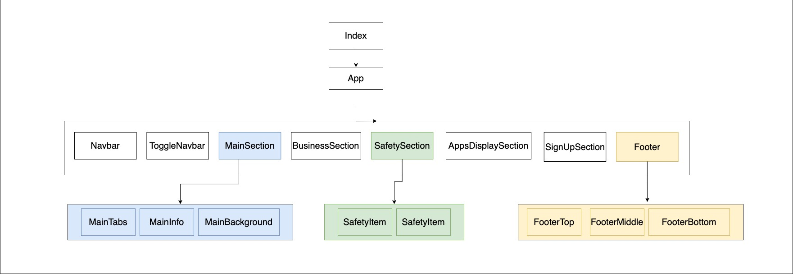

# Uber React

## About this Project

A static website built through React.js and the styles are based on [Uber](https://www.uber.com/tw/en/)

## Component Structure



<br />

## [Demo website](https://angry-golick-4e759a.netlify.app)

<br />

## To start the project locally

on your terminal

```
git clone https://github.com/mhsiungw/uber-react.git
```

```
cd uber-react
```

```
npm i
```

```
npm run start
```

The app will then start running at localhost:3000
